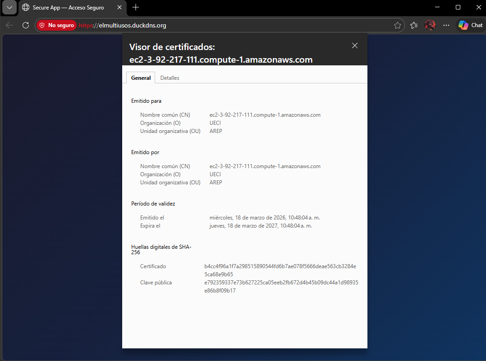
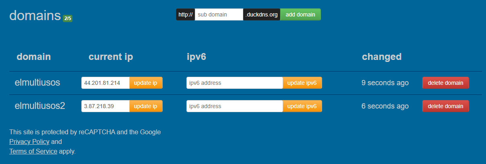

# Diseño de Aplicación Segura — Taller de Arquitecturas Empresariales

## Descripción General

Aplicación web segura de dos servidores desplegada en AWS:

- **Servidor 1 (Apache):** entrega el cliente HTML+JavaScript de forma asíncrona mediante HTTPS.
- **Servidor 2 (Spring Boot):** expone una API REST protegida con TLS, autenticación HTTP Basic y contraseñas almacenadas como hash BCrypt.

## Arquitectura

```
Navegador (HTTPS)
    │
    ▼
┌──────────────────────────────────┐       HTTPS/TLS       ┌──────────────────────────────────┐
│  Servidor 1 · Apache (EC2)       │ ───────────────────▶  │  Servidor 2 · Spring Boot (EC2)  │
│                                  │                       │                                   │
│  · Sirve index.html + app.js     │                       │  · API REST  (:8443)              │
│  · TLS con Let's Encrypt         │                       │  · TLS con Let's Encrypt          │
│  · Puerto 443 (HTTPS)            │                       │  · Contraseñas en BCrypt          │
│  · Puerto 80 → redirige a 443    │                       │  · Base de datos H2 en memoria    │
│  · Cabeceras de seguridad        │                       │  · Spring Security (HTTP Basic)   │
└──────────────────────────────────┘                       └──────────────────────────────────┘
```

### Características de Seguridad

| Característica                   | Implementación                                                               |
| -------------------------------- | ---------------------------------------------------------------------------- |
| Cifrado en tránsito (Servidor 1) | TLS mediante Let's Encrypt / Certbot                                         |
| Cifrado en tránsito (Servidor 2) | TLS mediante Let's Encrypt → keystore PKCS12                                 |
| Almacenamiento de contraseñas    | Hash BCrypt (nunca en texto plano)                                           |
| CORS                             | Lista blanca de orígenes configurada por variable de entorno                 |
| Validación de entrada            | Verificación de nulos/vacíos, 409 en usuario duplicado                       |
| Cabeceras de seguridad HTTP      | `Strict-Transport-Security`, `X-Frame-Options`, `X-Content-Type-Options`     |
| Endpoints protegidos             | Spring Security HTTP Basic en `/api/hello`                                   |
| Separación de configuración      | Todos los secretos en variables de entorno (principio 12-factor, Factor III) |

---

## Estructura del Proyecto

```
.
├── demo/                          # Servidor 2 — API REST Spring Boot
│   ├── pom.xml
│   └── src/main/java/com/secureApp/Web/
│       ├── WebApplication.java            # Punto de entrada
│       ├── config/SecurityConfig.java     # TLS + CORS + BCrypt
│       ├── controller/AuthController.java # /api/auth/** (público)
│       │                                  # + /api/hello (protegido)
│       ├── model/User.java
│       ├── repository/UserRepository.java
│       └── service/UserService.java
│
└── apache-client/                 # Servidor 1 — Archivos estáticos para Apache
    ├── index.html                 # SPA de login/registro
    ├── app.js                     # Llamadas async con fetch() a la API Spring
    └── apache-vhost.conf          # Configuración TLS de Apache VirtualHost
```

---

## Endpoints de la API

| Método | Ruta                 | Requiere auth   | Descripción                              |
| ------ | -------------------- | --------------- | ---------------------------------------- |
| `GET`  | `/api/auth/status`   | No              | Verificación de conexión TLS             |
| `POST` | `/api/auth/register` | No              | Registrar usuario (contraseña en BCrypt) |
| `POST` | `/api/auth/login`    | No              | Validar credenciales                     |
| `GET`  | `/api/hello`         | Sí (HTTP Basic) | Endpoint protegido de demostración       |

### Ejemplos de peticiones

```bash
# Registrar usuario
curl -k -X POST https://tu-servidor-spring:8443/api/auth/register \
  -H "Content-Type: application/json" \
  -d '{"username":"alice","password":"clave123"}'

# Iniciar sesión
curl -k -X POST https://tu-servidor-spring:8443/api/auth/login \
  -H "Content-Type: application/json" \
  -d '{"username":"alice","password":"clave123"}'

# Endpoint protegido (HTTP Basic)
curl -k https://tu-servidor-spring:8443/api/hello \
  -u alice:clave123
```

---

## Variables de Entorno

| Variable            | Valor por defecto                   | Descripción                                    |
| ------------------- | ----------------------------------- | ---------------------------------------------- |
| `PORT`              | `8443`                              | Puerto de escucha de Spring Boot               |
| `KEYSTORE_PATH`     | `classpath:keystore/ecikeypair.p12` | Ruta al keystore PKCS12                        |
| `KEYSTORE_PASSWORD` | `123456`                            | Contraseña del keystore                        |
| `KEY_ALIAS`         | `ecikeypair`                        | Alias de la llave dentro del keystore          |
| `ALLOWED_ORIGIN`    | `https://localhost`                 | Origen(es) CORS permitidos, separados por coma |

> **Principio 12-factor (Factor III — Configuración):** Ningún secreto está en el código. Todo se pasa mediante variables de entorno antes de iniciar la aplicación.

---

## Despliegue en AWS (Paso a Paso)

### Requisitos previos

- Dos instancias EC2 (Amazon Linux 2023), ambas con puertos 80 y 443 abiertos en los Security Groups.
- El Servidor 2 adicionalmente necesita el puerto 8443 abierto.
- Un nombre de dominio apuntando a cada instancia Apache -> https://elmultiusos.duckdns.org/ y Spring -> https://elmultiusos2.duckdns.org/.
- Java 17 instalado en el Servidor 2.

---

### Servidor 1 — Apache (Frontend)

#### 1. Instalar Apache y Certbot

```bash
sudo dnf update -y
sudo dnf install -y httpd mod_ssl
sudo systemctl enable --now httpd

# Instalar Certbot
sudo dnf install -y python3-certbot-apache
```

#### 2. Obtener certificado Let's Encrypt

```bash
sudo certbot --apache -d elmultiusos.duckdns.org
```

Certbot edita automáticamente la configuración de Apache y programa la renovación del certificado.

#### 3. Desplegar el frontend

```bash
sudo cp index.html /var/www/html/index.html
sudo cp app.js     /var/www/html/app.js
```

#### 4. Configurar la URL del servidor Spring

Editar `/var/www/html/index.html` y agregar antes de `<script src="app.js">`:

```html
<script>
  window.API_URL = "https://elmultiusos2.duckdns.org:8443";
</script>
```

#### 5. Aplicar la configuración VirtualHost

```bash
sudo cp apache-vhost.conf /etc/httpd/conf.d/elmultiusos.ducksdns.org.conf
sudo nano /etc/httpd/conf.d/elmultiusos.ducksdns.org.conf
sudo systemctl reload httpd
```

---

### Servidor 2 — Spring Boot (Backend)

#### 1. Instalar Java 17

```bash
sudo dnf install -y java-17-amazon-corretto-headless
java -version
```

#### 2. Obtener certificado Let's Encrypt y convertir a PKCS12

```bash
# Instalar Certbot en modo standalone
sudo dnf install -y python3-certbot
sudo certbot certonly --standalone -d elmultiusos2.duckdns.org

# Convertir certificados PEM a keystore PKCS12
sudo openssl pkcs12 -export \
  -in    /etc/letsencrypt/live/elmultiusos2.duckdns.org/fullchain.pem \
  -inkey /etc/letsencrypt/live/elmultiusos2.duckdns.org/privkey.pem \
  -out   /home/ec2-user/keystore.p12 \
  -name  springalias \
  -passout pass:tu-contrasena-keystore
```

#### 3. Subir y ejecutar el JAR

Se genero el .JAR con mvn clean package -DskipTests 2>&1 | Select-Object -Last 40

```bash
# Desde tu máquina local:
scp -i Apache.pem demo/target/demo-0.0.1-SNAPSHOT.jar ec2-3-87-218-39.compute-1.amazonaws.com:/home/ec2-user/

# En el servidor Spring:
export PORT=8443
export KEYSTORE_PATH=/home/ec2-user/keystore.p12
export KEYSTORE_PASSWORD=tu-contrasena-keystore
export KEY_ALIAS=springalias
export ALLOWED_ORIGIN=https://elmultiusos.duckdns.org

java -jar /home/ec2-user/demo-0.0.1-SNAPSHOT.jar
```

---

## Pruebas en Local (Desarrollo)

#### Generar certificado autofirmado para pruebas locales

```bash
keytool -genkeypair \
  -alias ecikeypair \
  -keyalg RSA -keysize 2048 \
  -storetype PKCS12 \
  -keystore demo/src/main/resources/keystore/ecikeypair.p12 \
  -validity 3650 \
  -dname "CN=localhost, OU=Dev, O=SecureApp, L=Bogota, S=Cundinamarca, C=CO" \
  -storepass 123456
```

#### Iniciar el servidor Spring Boot

```bash
cd demo
mvn spring-boot:run
# API disponible en https://localhost:8443
```

#### Abrir el frontend

Abrir `apache-client/index.html` directamente en el navegador.
El navegador mostrará una advertencia por el certificado autofirmado — aceptarla para continuar las pruebas.

> La variable `window.API_URL` apunta a `https://localhost:8443` por defecto, así que funciona sin cambios adicionales en local.

---

## Notas de Diseño de Seguridad

### ¿Por qué BCrypt para contraseñas?

BCrypt es un algoritmo de hash deliberadamente lento y con sal. Aunque la base de datos fuera comprometida, recuperar las contraseñas originales desde los hashes sería computacionalmente inviable. `BCryptPasswordEncoder` de Spring Security es el estándar de la industria en Java.

### ¿Por qué TLS en todos lados?

Sin TLS, las credenciales y los datos de sesión viajan en texto plano y cualquier intermediario de red puede interceptarlos (ataque man-in-the-middle). TLS garantiza:

- **Confidencialidad:** datos cifrados en tránsito
- **Integridad:** detección de manipulación
- **Autenticación:** el certificado verifica la identidad del servidor

### ¿Por qué dos servidores separados?

Separar el frontend estático (Apache) de la API (Spring Boot) aplica:

- **Principio de mínimo privilegio:** cada servidor ejecuta solo lo que le corresponde
- **Reducción de superficie de ataque:** comprometer un servidor no expone automáticamente al otro
- **Escalabilidad:** cada capa puede escalarse de forma independiente

### Cumplimiento con la metodología 12-Factor App

- **Factor III (Configuración):** Toda la configuración específica del entorno (puertos, contraseñas, orígenes) se carga desde variables de entorno, nunca está hardcodeada.
- **Factor VI (Procesos):** Aplicación sin estado; la base de datos H2 en memoria puede reemplazarse por una base de datos persistente mediante variable de entorno.

---

## Capturas de Pantalla

1. Navegador mostrando el candado `https://` en el frontend Apache



2. DuckDNS



3. Registro exitoso de usuario
4. Login exitoso con respuesta 200
5. Respuesta 401 con credenciales incorrectas
6. `GET /api/hello` retornando 200 con credenciales HTTP Basic
7. Consola de AWS EC2 con ambas instancias ejecutándose

---

## Autor

Juan Sebastian Buitrago Piñeros — Taller de Arquitecturas Empresariales (AREP)
